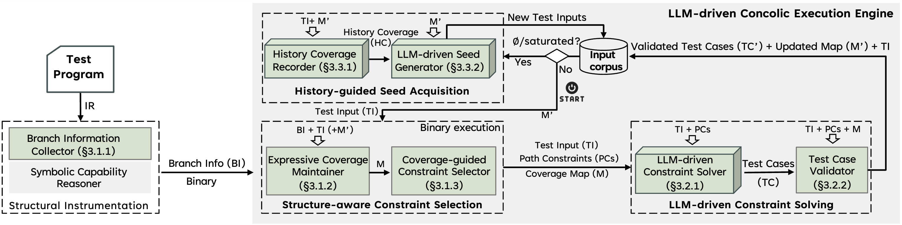

# Cottontail: Large Language Model-Driven Concolic Execution for Structured Test Input Generation

[](LICENSE)
[](https://haoxintu.github.io/files/sp2026-cottontail.pdf)


Cottontail is a cutting-edge concolic execution engine powered by large language models (LLMs), designed for highly structured test input generation. Presented at <a href="https://sp2026.ieee-security.org/">IEEE Symposium on Security and Privacy (S&P) 2026</a>, Cottontail advances the state-of-the-art in automated software testing by integrating expressive program path representation, LLM-driven constraint solving, and history-guided seed acquisition.

(A fun fact: the logo of cottontail is generated by Google Gemini :grinning:).


## Features

- **Expressive Coverage Tree (ECT):** A high-level representation of structural program paths to help structure-aware path constraint selection for comprehensive program analysis.
- **LLM-Driven Constraint Solver:** Smartly solves path constraints to generate syntactically valid and path-constraint satisfiable test inputs.
- **History-Guided Seed Acquisition:** Efficiently discovers new, highly structured test inputs to maximize coverage, based on the naming convention of the functions.
- **Sound Analysis:** All test cases from LLM are validated to ensure that the resulting behaviors are sound, consistent with the underlying principles of concolic execution.

## System Design



## 📄 [Read the Paper](https://haoxintu.github.io/files/sp2026-cottontail.pdf)

## Repository Structure

```
.
├── LICENSE                      # Project license (GPLv3)
├── README.md                    # Project documentation and usage
├── Dockerfile                   # Docker build instructions for Cottontail
├── docker-compose.yml           # Docker Compose configuration (if multi-container)
├── benchmark-test/              # Example benchmarks and test scripts
│   ├── build-json-c.sh          # Script to build the JSON-C benchmark
│   └── input/                   # Input seeds for benchmarks
├── config/
│   ├── config.ini               # Main configuration file
│   └── config.docker.ini        # Docker-specific configuration
├── cottontail-compiler/
│   ├── build-cottontail-compiler.sh         # Build script for native environment
│   ├── build-cottontail-compiler-docker.sh  # Build script for Docker
│   ├── CMakeLists.txt                        # CMake build configuration
│   ├── compiler/                             # Compiler source code
│   ├── docs/                                 # Compiler documentation
│   ├── runtime/                              # Runtime libraries for compiler
│   ├── test/                                 # Compiler test cases
│   └── util/                                 # Compiler utilities
├── docs/
│   ├── cottontail-logo-focus.png             # Project logo (focus version)
│   ├── cottontail-logo.png                   # Project logo
│   └── overview.png                          # System design/architecture diagram
├── scripts/
│   ├── collect_coverage.sh     # Script to collect code coverage
│   ├── prepare.sh              # Install dependencies and prepare environment
│   └── run-cottontail.py       # Main entry point for concolic testing
```

## Getting Started

* You may choose two approaches (`Docker` or `Native Env`) to run `Cottontail`.

### Approach 1: Run in Docker

To build the Docker image:

```bash
docker build -t cottontail:latest .
```

To run the Docker container with your OpenAI API key and get an interactive bash shell (for debugging or manual commands):

```bash
docker run -it -e cottontail:latest bash
```

Replace the `YOUR_OPENAI_API_KEY_HERE` with your key in the `config.ini` file and is ready to go:

```
python3 run-cottontail.py
```

After a few minutes, you will see the similar expected output mentioned below in [5. Launch Concolic Testing](#5-launch-concolic-testing).

### Approach 2: Run in Native Enviroment

#### 0. System Requirements

The prototype of `Cottontail` is running on the following environment.

* Ubuntu 18.04
* LLVM-11.0.0
* Python 3.9.16
* GCC-7.5 
* Gcovr 8.3

#### 1. Install Dependencies

Run the provided script to install all required dependencies (please feel free to comment out the packages such as `z3` and `llvm-11` are already installed in your system):

```bash
$./scripts/prepare.sh
```

#### 2. Build the Cottontail Compiler

Compile the customized `cottontail-cc` compiler:

```bash
$cd cottontail-compiler
$./build-cottontail-compiler.sh
```

#### 3. Build Test Programs (via An Example)

Navigate to the benchmark directory and build the example:

```bash
$cd benchmark-test
$./build-json-c.sh
```

#### 4. Configure Settings

Edit `config.ini` to specify your `GPT/DeepSeek Model`, `API key`, and the `testing folder`:

```
gpt_model = gpt-4o-mini
api_key = YOUR_OPENAI_API_KEY_HERE

mainDir = xx/benchmark-test
```

Example configuration:
```
[common-settings]
format = JSON
llm_model = gpt-4o-mini
api_key = sk-xxx


[gcov-locations]
mainDir = xx/benchmark-test
gcovDir = %(maindir)s/json-c/build-gcov/apps/
sourceDir = %(maindir)s/json-c/
recordFile = %(maindir)s/json-c/build-gcov/all_records.txt

[running-locations]
mainDir = xx/benchmark-test
inputDir = %(maindir)s/input
outputDir = %(maindir)s/output
failedDir = %(maindir)s/failed-cases

[running-targets]
mainDir = xx/benchmark-test
cottontailTarget = %(maindir)s/json-c/build-cottontail/apps/json_parse
gcovTarget = %(maindir)s/json-c/build-gcov/apps/json_parse

[running-params]
timeout = 43200 // running timeout
cov_timeout = 60 // interval timeout for coverage collection
```

#### 5. Launch Concolic Testing

You are ready to go. Start the concolic testing process by running:

```bash
$pwd
xxx/benchmark-test
$python run-cottontail.py
```

The expected output would be 

```
Recreated folder: output
Removed *.gcda files in: benchmark-test/json-c
Constructed path: benchmark-test/json-c/build-gcov/apps/all_records.txt
Importing benchmark-test/input/seed from the input directory
++++++++++++Generation 0 ++++++++++++
Running on /tmp/tmpvfngz8zh/cur/seed
GPT solving running

Now concolic executing  /tmp/tmpvfngz8zh/cur/seed
Content:
  /tmp/tmpvfngz8zh/cur/seed
model :  gpt-4o-mini
Keys in path-constraints-expr.json have been simplified and saved.
total_pc_cnt =  101
total_pc_cnt =  101
+++ LOG:  {'executed file': '/tmp/tmp_nk9rl2i/cur/seed', 'duration': 0.018297195434570312, 'gpt_invocation_cnt': '1', 'gpt_solving_time': '1.192103624343872', 'gpt_seed_generation_cnt': '0', 'gpt_history_update_cnt': '0', 'total_pc_cnt': '101', 'gpt_generated_testcases_cnt': '1', 'gpt_missed_testcases_cnt': '0', 'valid_solving_cnt': '1', 'invalid_solving_cnt': '0', 'is_not_interesting_cnt': '0', 'prompt_token_cnt': '1316'}
+++ LOG:  {'executed file': '/tmp/tmp_nk9rl2i/cur/seed', 'duration': 11.306709051132202, 'gpt_invocation_cnt': '2', 'gpt_solving_time': '0.7505309581756592', 'gpt_seed_generation_cnt': '0', 'gpt_history_update_cnt': '0', 'total_pc_cnt': '101', 'gpt_generated_testcases_cnt': '2', 'gpt_missed_testcases_cnt': '0', 'valid_solving_cnt': '1', 'invalid_solving_cnt': '1', 'is_not_interesting_cnt': '0', 'prompt_token_cnt': '2684'}
...
```

After a few minutes, you will see the coverage report 

```
$ cat benchmark-test/json-c/build-gcov/apps/all_records.txt
lines: 17.6% (817 out of 4640) functions: 28.2% (85 out of 301) branches: 14.6% (403 out of 2759) Fri Nov 28 11:15:18 +08 2025
lines: 18.3% (847 out of 4640) functions: 28.2% (85 out of 301) branches: 15.5% (428 out of 2759) Fri Nov 28 11:16:21 +08 2025
lines: 19.6% (909 out of 4640) functions: 30.9% (93 out of 301) branches: 16.7% (460 out of 2759) Fri Nov 28 11:16:43 +08 2025
lines: 19.6% (909 out of 4640) functions: 30.9% (93 out of 301) branches: 16.7% (461 out of 2759) Fri Nov 28 11:17:24 +08 2025
lines: 19.6% (911 out of 4640) functions: 30.9% (93 out of 301) branches: 16.9% (465 out of 2759) Fri Nov 28 11:18:27 +08 2025

```

## Other benchmarks

Please check [benchmarks](https://github.com/Cottontail-Proj/benchmarks) for other subjects used in the paper.

## Acknowledgements

We gratefully acknowledge the creators of [SymCC](https://github.com/eurecom-s3/symcc), [MuJS](https://github.com/ccxvii/mujs), and [QuickJS](https://github.com/quickjs-ng/quickjs) for their foundational work and swift responses to our feedback. We also thank the anonymous reviewers for their valuable insights.

## License

Cottontail is released under the [GNU General Public License v3.0](https://www.gnu.org/licenses/gpl-3.0.html), following [SymCC](https://github.com/eurecom-s3/symcc).

You are free to copy, modify, and distribute this software under the terms of the GPLv3.  
This program is distributed in the hope that it will be useful, but WITHOUT ANY WARRANTY;  
without even the implied warranty of MERCHANTABILITY or FITNESS FOR A PARTICULAR PURPOSE.  
See the [LICENSE](LICENSE) file for the full text.

## Citation

If you use `Cottontail` in your research, please cite:

```
@inproceedings{cottontail-sp26,
  author={Tu, Haoxin and Lee, Seongmin and Li, Yuxian and Chen, Peng and Jiang, Lingxiao and Böhme, Marcel},
  title={{Cottontail: Large Language Model-Driven Concolic Execution for Highly Structured Test Input Generation}},
  booktitle={2026 IEEE Symposium on Security and Privacy (SP)},
  ISSN = {2375-1207},
  pages = {2064-2082},
  year={2026},
  doi = {10.1109/SP63933.2026.00110},
  url = {https://doi.ieeecomputersociety.org/10.1109/SP63933.2026.00110},
  publisher = {IEEE Computer Society},
  address = {Los Alamitos, CA, USA},
}
```

## Contact

If you have any questions about the current project or seek for future collaboration, please reach out to haoxintu@gmail.com.
